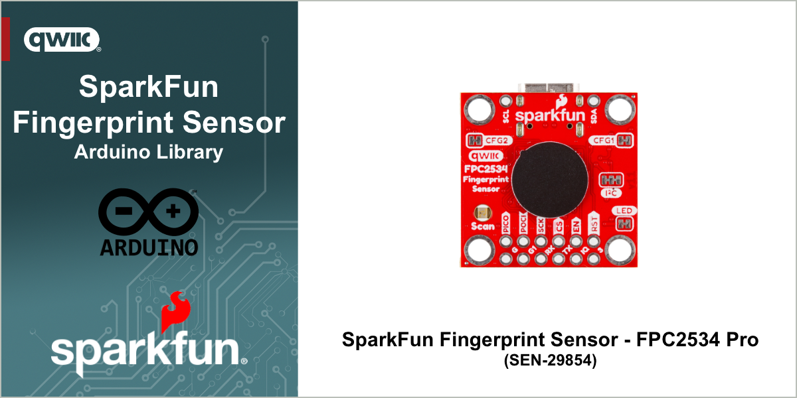
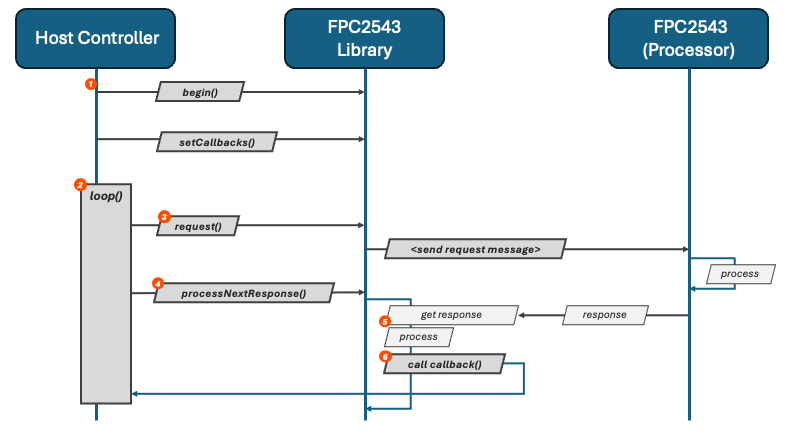
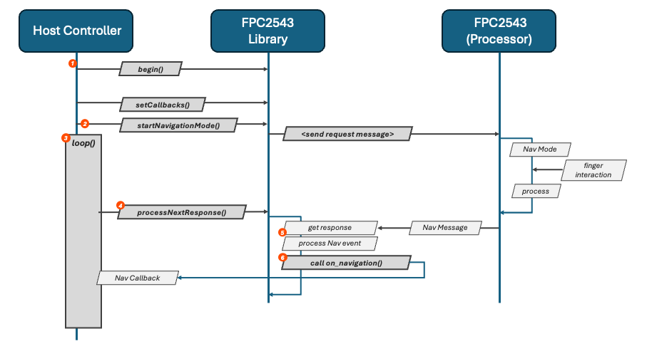
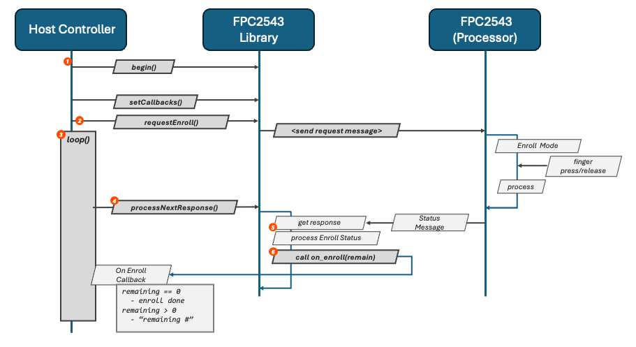

# SparkFun Fingerprint Sensor - FPC2534 Pro

Arduino Library for the SparkFun Fingerprint Sensor - FPC2534 Pro


[](https://github.com/sparkfun/SparkFun_FPC2534_Arduino_Library/actions/workflows/test-compile-sketch.yml)


The [SparkFun Fingerprint Sensor - FPC2534 Pro](https://www.sparkfun.com/sparkfun-fingerprint-sensor-fpc2534-qwiic.html) is a small, highly capable and robust fingerprint sensor that can easily be integrated into virtually  any application. Based off the AllKey Biometric System family from Fingerprints Cards (FPC), the FPC2534AP delivers incredible functionality in a small, compact form factor.

## Functionality

The SparkFun Fingerprint Sensor - FPC2534 Pro is accessible via a variety of interfaces, including I2C, UART and SPI, which are supported by this library.

This library provides a message-based, easy to use interface that enables fingerprint biometric authentication and simple finger-based navigation. Specifically, the FPC2534AP provides:

- Fingerprint enrollment - adding a fingerprint to the sensor
- Fingerprint template management - managing recorded fingerprints
- Fingerprint matching/identification  for biometric authentication
- Trackpad like functionality for simple, finger-based navigation
- Application integration via a variety of communication methods

> [!NOTE]
> The structure of the I2C transactions implemented by the FPC2434 sensor are not directly supported by the Arduino Wire/I2C library. To support the I2C interface to the FPC2434, this library implements *helper* functions that handle the FPC2434 I2C transactions. These implementations are only ***supported on RP2 and ESP32*** systems.

### Functionality not Supported by the Library

Features that the FPC2534 supports, but are not currently implemented by this library include:

- Encrypted communication. When enabled, the communication to/from the FPC2543 is encrypted by a user provided key. Once this key is set in the device, it cannot be changed.
- Reading and writing template data values to/from the sensor.
- USB Interface - while the SparkFun FPC2534 provides a USB-C interface (enabled via jumper settings), this library doesn't support this interface. This mode of communication is primarily used for computer (non-microcontroller) interaction with the device.

If any of these advanced features are desired for use, an implementation can be found within the Fingerprints FPC2543 SDK, which is available on the [Fingerprints Website](https://www.fpc.com/products/documentation/).

## Communication

The operation of the FPC2534AP is performed by a messaging protocol implemented on the device. A client application sends message requests to the sensor and receives  responses to the request made.

To support integration and messaging, the FPC2534AP provides support for four (4) different communication implementations. These are:

- I2C
- UART
- SPI
- USB

The communication method used is selected via a pair of configuration jumpers on the SparkFun Fingerprint Sensor - FPC2534 Pro board. Further information on the use is outlined in the associated Hookup Guide for the SparkFun fingerprint breakout board.

> [!NOTE]
> The I2C (qwiic) interface for the SparkFun Fingerprint Sensor - FPC2534 Pro board is currently only supported on ESP32 and Raspberry RP2 (RP2040, RP2350) boards. The I2C implementation  of the FPC2534 device performs a dynamic payload transmission that is not supported by the Arduino Wire library. Because of this, a custom implementation is provided by this library for the ESP32 and RP2 platforms.

### Additional Connections

In addition to the communication method selected, the FPC2534AP requires additional connections to facilitate communication. The following connections are required:

| Pin | Use | Notes |
| -- | -- | -- |
|RST | Reset Device | Setting the pin low, then high will reset the FPC2534AP, placing it into a known state|
|IQ| IRQ/Interrupt Request|Used by the sensor to signal a new message/data availability  - note: this is not required when using the serial interface|

## Library

Unlike a majority of sensors and their associated libraries which are synchronous function calls - a function/method call returns a requested value or performs a specific action - the FPC2534AP operates using a messaging methodology  - sending messages to the client as actions occur on the device, or in response to earlier requests.

Since messaging methodology is used by the FPC2534AP, this library makes use of the following implementation pattern:

- User provided callback functions that the library calls when a specific message is received  from the library (like when a finger is pressed on the sensor).
- A process message method that is called to process the next available message from the sensor if one is available. This method is called within your applications main processing loop (for Arduino, this is the `loop()` function).

While this methodology  is unique to the when compared  to other libraries, it fits well with the event driven nature of the FPC2534AP fingerprint sensor.

### Using the Library

The first step to using the library is selected the method used to communicate with the device. The library supports I2C on select platforms, UART (a Serial interface in Arduino) or SPI. Once selected, and device connected as outlined in the hookup guide for the SparkFun Fingerprint Sensor - FPC2534 Pro. The type of connection depends on the method used to communicate with the device.

#### Getting Started

How the sensor is initialized is dependent  on the communication method being utilized. The following sections outline how to use setup and initialize the I2C, UART or SPI interfaces to the device. Once setup, the operation of the device is communication method independent.

##### Using I2C (Qwiic)

When using I2C to communicate with the fingerprint sensor, the class named `SfeFPC2534I2C` is used. An example of how to declare the sensor object is as follows:

```c++
// Declare our sensor object
SfeFPC2534I2C mySensor;
```

To initialize the device, the following is needed:

- The address of the device
- The Arduino Wire object being used for the device
- The number for the I2C bus being used (this is needed to support I2C read operations from the sensor) - Normally this is a value of `0` or `1`
- The Pin number the IRQ of the device is connected to. This IRQ is used by the sensor to indicated data is available for reading from the device.

An example of calling the begin method:

```c++
    bool status =  mySensor.begin(SFE_FPC2534_I2C_ADDRESS, Wire, i2cBusNumber, interruptPin );
```

At this point, the sensor is ready for normal operation.

###### A note on "pinging" the FPC2534 sensor

Often, to determine if a sensor is available on the I2C bus, the bus is queried at the address for the device  (a simple "ping"). In Arduino this often looks like:

```c++
// Is the sensor there - on the I2C bus?
    Wire.beginTransmission(kFPC2534DefaultAddress);
    if (Wire.endTransmission() == 0)
        Serial.println("The Touch Sensor FPC2534 is available");
```

Developing with the sensor has shown that once the sensor is "pinged", it enters an unknown state. To ensure proper device operation, a `reset()` of the device is needed after a `ping` operation is performed.

> [!NOTE]
> The I2C (qwiic) interface for the SparkFun Fingerprint Sensor - FPC2534 Pro board is currently only supported on ESP32 and Raspberry RP2 (RP2040, RP2350) boards. The I2C implementation  of the FPC2534 device performs a dynamic payload transmission that is not supported by the Arduino Wire library. Because of this, a custom implementation is provided by this library for the ESP32 and RP2 platforms.

##### Using UART (Serial)

When using a UART (Serial) to communicate with the fingerprint sensor, the class named `SfeFPC2534UART` is used. An example of how to declare the sensor object is as follows:

```c++
// Declare our sensor object
SfeFPC2534UART mySensor;
```

Configure the following settings on the UART/Serial connection being used:

| Setting | Value |
| -- | -- |
| Baud Rate | 921600 |
| Config | SERIAL_8N1|
| Read Buffer Size | 512|

> [!NOTE]
> Due to the amount of information sent by the fingerprint sensor, the default size of the internal buffer used by Arduino Serial objects is rapidly exceeded. To prevent this, the buffer size must be increased before initializing the FPC2534AP device.  
>
> To increase the buffer size when using a Raspberry pi RP2 Microcontroller:
>
> ```c++
>  Serial1.setFIFOSize(512);
>```
>
> On an ESP32:
>
> ```c++
>  Serial.setRxBufferSize(512);
> ```

If using a different controller for your project, the method used to expand the Serial read buffer will need to be determined. Some platforms (STM32 appears to self-adjust FIFO size) no additional calls are needed, but on others (normally older systems) no option exists rendering the Serial interface the FPC2543 un-usable on the platform.

To initialize the device, the Serial object used to communicate with the device is passed into the begin call.

An example of calling the begin method:

```c++
    bool status = mySensor.begin(Serial1);
```

At this point, the sensor is ready for normal operation.

##### Using SPI

When using SPI to communicate with the fingerprint sensor, the class named `SfeFPC2534SPI` is used. An example of how to declare the sensor object is as follows:

```c++
// Declare our sensor object
SfeFPC2534I2C mySensor;
```

To initialize the device, the following is needed:

- The SPI bus to use - if using a the simple begin function, the default bus is used.
- The Settings for the SPI connection - if using a the simple begin function, default settings are used.
- The CS PIN for the SPI connection
- The Pin number the IRQ of the device is connected to. This IRQ is used by the sensor to indicated data is available for reading from the device.

An example of calling the simple begin method:

```c++
    bool status =  mySensor.begin(myCSPin, interruptPin );
```

At this point, the sensor is ready for normal operation.

> [!NOTE]
> In the provided examples, the FPC2534 sensor is reset after the ```begin``` method is called, to ensure the senors is in a startup state.

#### General Operation

The operational pattern for the SparkFun FPC2543 Fingerprint sensor library is outlined in the following diagram:



1) The first step is library initialization and setup.
   - The communication interface being used is provided to the library.
   - The operation callback functions are registered. These functions are called in response to commands sent to the sensor.
2) The next phase normally occurs in the ```loop``` section of system operation.
3) The application makes a request/sends a command to the sensor. These calls are asynchronous, and result in a message being sent to the sensor by the library.
4) During each loop iteration, the library method ```processNextResponse()``` is called. This method will check for new messages and process any messages sent by the sensor.
5) When checking for new messages, the library gets the next message/response from the device via the in-use communication bus. This message is parsed and processed.
6) When a response message is parsed and identified, if the host application has registered a callback for this message type, that callback function is called.
   - The user takes the desired application action in the callback function.

The loop sequence of operation - make a request, check for messages and respond via callback functions continue during the operation of the sensor.

##### Callback Functions

The results from the FPC2543 sensor are reported through the use of callback functions, which are user provided. While more advanced that standard functional programming, this implementation pattern is recommended by the FPC2543 manufacturer and fits nicely with the operational use of the sensor.

Callback functions are assigned with a structure of type ```sfDevFPC2534Callbacks_t```, which is passed to the library during the setup sequence.

The following callbacks are available for use:

| Callback Name | Description|
| -- | -- |
|on_error| Called when the sensor send an error message. An error code is provided|
|on_status| Called with status update information from the sensor|
|on_version| Called as a result of a version request. The version string is passed to the callback|
|on_enroll| Called during a fingerprint enrollment process. The number of samples remaining and feedback are provided|
|on_list_templates | Called with the results of a ```requestListTemplates()``` call|
|on_navigation| Called when a navigation event is sent from the sensor|
|on_gpio_control| Called as the result of a GPIO get request call|
|on_system_config_get| Called when the system config is requested|
|on_bist_done| Called when the built-in testing routine is finished. The result of this test is provided|
|on_mode_change| Called when the mode of the sensor changes|
|on_finger_change | Called when the finger presence on the sensor changes|
|on_is_read_change| Called when the ready status of the sensor changes|

##### Startup Status Message

When the FPC2534 starts up, it posts a *is ready for use* status message, which can be detected within the ```on_status()``` callback function if provided to the library.

Another option is to register a ```on_is_ready_change()``` callback function, which is called when the ready state of the sensor changes. This simplifies the required implementation for using the sensor.

It the examples provided with this library, the ```on_is_ready_change()``` callback is used to determine when the sensor is ready for operation. When this callback is called with a "ready" value, the examples begin FPC2543 operations.

#### Error Conditions

If an error is reported by the sensor, the error value is pass to the registered ```on_error()``` callback function.

#### Navigation Mode

One of the operating modes of FPC2534 is *Navigation Mode*. Enabled by calling the ```startNavigationMode()``` on the library, the FPC2534 acts like a small touch pad/joystick when in Navigation Mode. It should be noted, the ```startNavigationMode()``` method also takes a parameter that sets the orientation of the sensor. This is used when determining event type (up, down, left, right).

Events from this mode are communicated to the callback function assigned in the ```on_navigation``` field of the callback function structure that is passed to the library. The following events are supported:

- Swipe left
- Swipe right
- Swipe up
- Swipe down
- Press - a quick press and remove of a finger from the sensor
- Long press - triggered after the finger stays pressed on the sensor for a "long time" (~1 second)

The operation of this mode is outlined in the following diagram:



1) Standard setup, with a ```on_navigation()``` callback function provided
2) Once the sensor is running, start navigation mode. The sensor will interpret finger movements as navigation events and send messages when events are detected.
3) Loop mode is entered
4) Messages from the sensor are processed
5) When a navigation event message is identified, the message is parsed and the corresponding navigation event sent to the supplied ```on_navigation()``` callback function.  

To further understand how to use Navigation mode, review the Navigation examples provided with this library.

- [Navigation using I2C](examples/Example01_NavigationI2C/Example01_NavigationI2C.ino)
- [Navigation using Serial](examples/Example03_NavigationUART/Example03_NavigationUART.ino)
- [Navigation using SPI](examples/Example05_NavigationSPI/Example05_NavigationSPI.ino)

#### Enroll a Fingerprint

Before the fingerprint sensor can validate a finger, that finger is enrolled into the sensor as a template. This operation is performed using an *Enroll Mode* of the sensor.

To enter the *Enroll Mode*, the ```requestEnroll()``` method is called in the library. Once in Enroll Mode, the user places and removes the desired finger from the sensor, and the sensor report back the number samples remaining/progress to the library. The library then calls the ```on_enroll()``` callback method as the process progresses. once the value of the remaining scans reaches zero, the process is complete.

This process is outlined in the following diagram:



1) Standard setup, with a ```on_enroll()``` callback function provided to the library.
2) Once the sensor is operational, the ```requestEnroll()``` method is called to start the enrollment process
3) A standard *loop*()* application pattern/method is started.
4) The method ```processNextResponse()``` is called on the library to get updates from the sensor.
5) The library identifies and parse an enrollment status message from the sensor
6) The registered ```on_enroll()``` callback method is called, with the number of samples remaining.
   - If the number is equal to zero, the process is complete and the fingerprint is enrolled/registered with the sensor.

> [!NOTE]
> An operational note when performing an enrollment process, when the user lifts their finger from the sensor, the ```on_status()``` callback method is called with an event type of ***EVENT_FINGER_LOST***. If this type is detected, and the method ```currentMode()``` returns a value of **STATE_IDENTIFY**, it's helpful to indicate progress to the user. In our examples, a `.` is printed.

To further understand how to use the Enroll mode in your application, review the Enroll and Identify examples provided with this library:

- [Enroll and Identify using I2C](examples/Example02_EnrollI2C/Example02_EnrollI2C.ino)
- [Enroll and Identify using Serial](examples/Example04_EnrollUART/Example04_EnrollUART.ino)
- [Enroll and Identify using SPI](examples/Example06_EnrollSPI/Example06_EnrollSPI.ino)

#### Identify a Fingerprint

Once the sensor has registered one or more fingerprints, an *Identify* operation can take place, matching a finger to an enrolled fingerprint. This is started by calling the ```requestIdentify()``` method of this library.

Once in Identify mode, the sensor will try to match a finger press to a registered fingerprint. The results of this match are communicated to the library and the user provided ```on_indentify()``` method is called with the results of the match process.

The overall identify sequence is outlined in the following diagram.


1) Standard setup, with a ```on_identify()``` callback function provided to the library.
2) Once the sensor is operational, the ```requestIdentify()``` method is called to start the identify process.
3) A standard *loop()* application pattern/method is started.
4) The method ```processNextResponse()``` is called on the library to get updates from the sensor.
5) The library identifies and parses an identify result message from the sensor.
6) The registered ```on_identify()``` callback method is called with the results from the identify operation.
   - If the match successful, a valid value for the id of the matched fingerprint template is also provided to the function

To further understand how to use the Identify mode in your application, review the Enroll and Identify examples provided with this library:

- [Enroll and Identify using I2C](examples/Example02_EnrollI2C/Example02_EnrollI2C.ino)
- [Enroll and Identify using Serial](examples/Example04_EnrollUART/Example04_EnrollUART.ino)
- [Enroll and Identify using SPI](examples/Example06_EnrollSPI/Example06_EnrollSPI.ino)

> [!NOTE]
> A behavior noticed when using I2C communication mode and performing an Identify operation was that the sensor can *hang* until the finger is removed from the sensor. When this occurs, the ```on_status()``` callback is called with an event type of ***EVENT_IMAGE_READ*** and method ```currentMode()``` reports a value of **STATE_IDENTIFY**. When detected, it is helpful to prompt the user to remove their finger from the sensor, which will return to normal operation.
